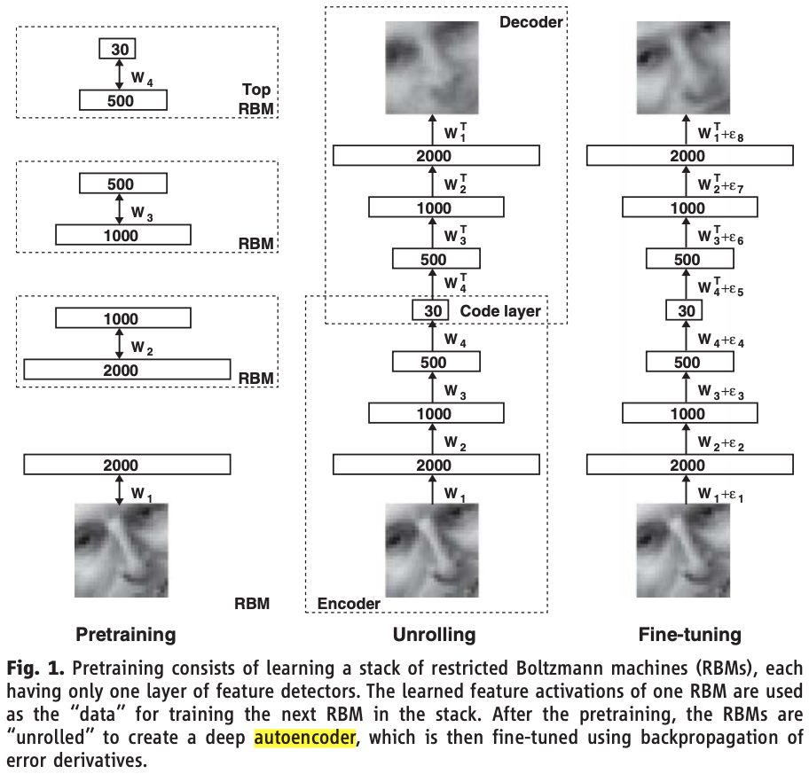
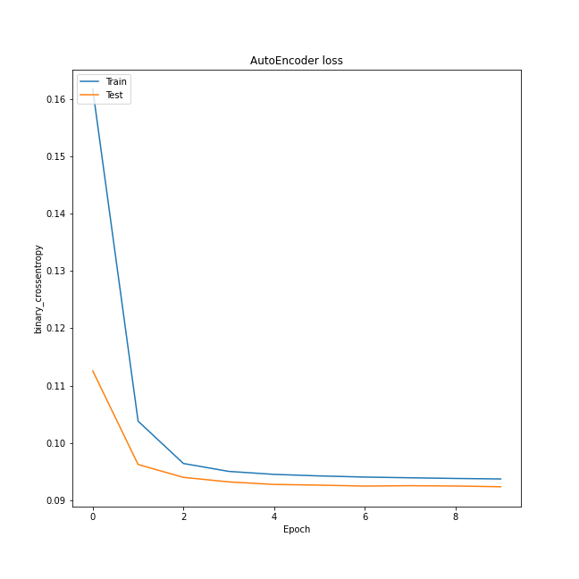
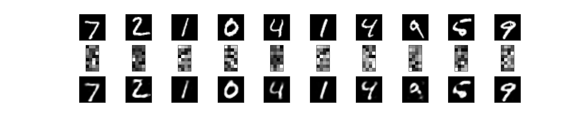

# [Auto Encoder](https://www.cs.toronto.edu/~hinton/science.pdf)
**入力層**で入力されたデータを**隠れ層**で圧縮し，**出力層**で復元する手法．この仕組みは，現在のDeepLearning手法において，セグメンテーションや画像生成といった分野で活躍している．入力層-隠れ層間でデータを圧縮して，重要なデータを抽出することを**エンコード**といい，隠れ層-出力層間でデータを元の次元に復元することを**デコード**という．

主な活用事例としては，以下の4つ．
- データの生成
- 異常検知
- ノイズ除去
- クラスタリング

今回は，手書き数字データセットとして知られるMNISTを用いて，画像の再構築を試みる．実際に動かすと以下のような結果が得られる．

### 損失関数の推移

### Reconstactionの結果

---
参考文献\
[1]Reducing the Dimensionality of Data with Neural Networks, G. E. HINTON AND R. R. SALAKHUTDINOV, SCIENCE, Vol 313, Issue 5786, pp. 504-507, 2006, https://www.cs.toronto.edu/~hinton/science.pdf