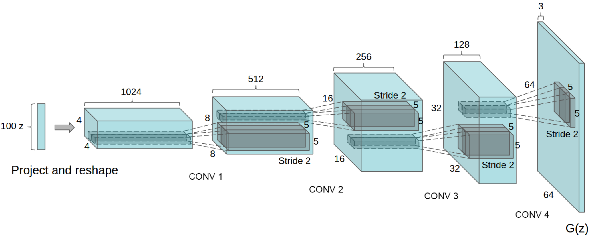

# [DCGAN(Deep Convolutional GAN)](https://arxiv.org/abs/1511.06434)
DCGAN(Deep Convolutional GAN)は，畳み込みニューラルネットワーク(CNN)を導入したGANである．オリジナルのGANでは生成画像がぼやけていたが，より自然な画像が生成できるようになった．ネットワークはオリジナルのGANと基本的に同じである．

Generatorでは以下のように，100次元のノイズベクトルを畳み込むことによって，64x64の画像にアップサンプリングしている．

Discriminatorでは，Generatorとは逆の過程でダウンサンプリングの構造である．

---
## 精度の推移

Discriminatorがほぼ100%の確率で本物か偽物かを識別できていることを示している．つまり，生成画像は騙せるほどの品質を

## 

---
参考文献\
[1]Unsupervised Representation Learning with Deep Convolutional Generative Adversarial Networks,Alec Radford, Luke Metz, Soumith Chintala, ICLR2016, https://arxiv.org/abs/1511.06434\