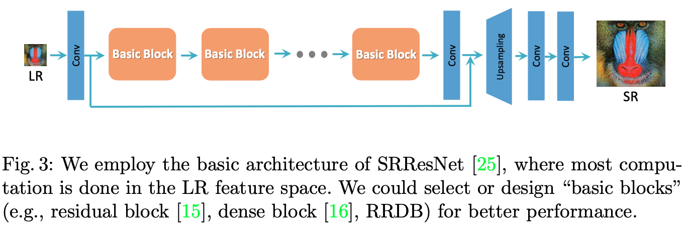
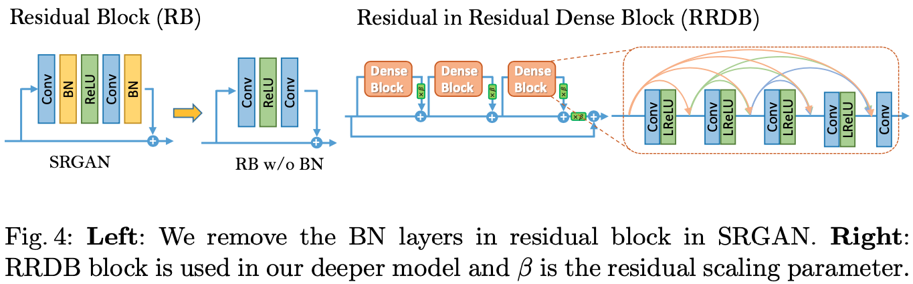
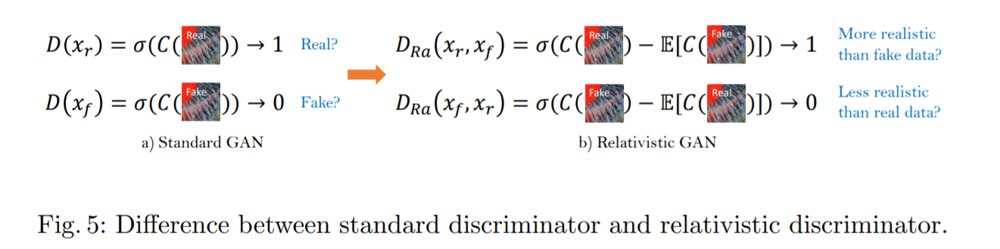
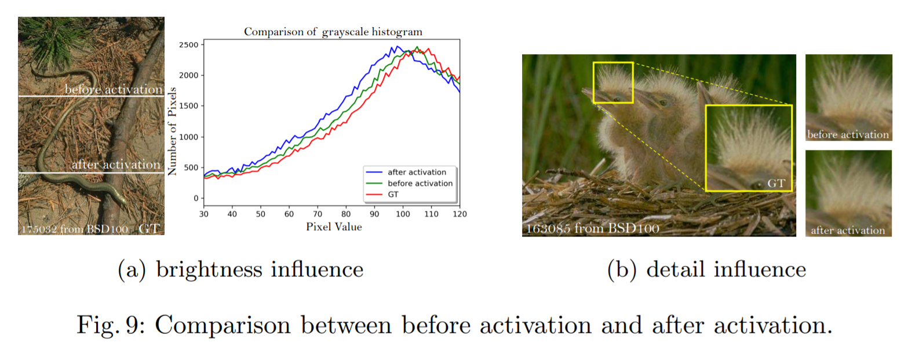
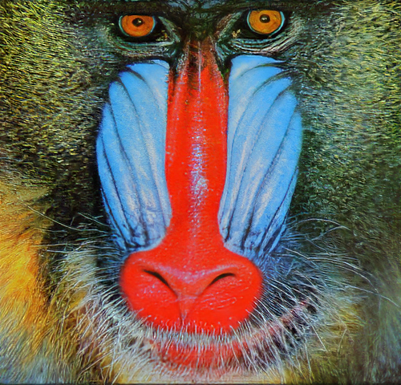

# [ESRGAN](https://openaccess.thecvf.com/content_ECCVW_2018/papers/11133/Wang_ESRGAN_Enhanced_Super-Resolution_Generative_Adversarial_Networks_ECCVW_2018_paper.pdf)

画素の粗い画像を鮮明にする「超解像」に特化したGANのひとつである．従来までの超解像GANとして知られるSRGANで課題とされていたアーティファクト(ノイズ)を抑制できるようになった．

### 従来と異なる特徴
- Batch Nomarizationをあえて利用しないことでモデル自身の表現力を高めている．

- Discriminatorの判断基準として「本物か偽物か」の絶対値ではなく，本物と偽物を比較した相対的差分を学習する．

- 活性化関数で処理される前の特徴量を用いることで，明るさの一貫性やテクスチャの復元に対し頑強になった．

---
### 出力結果
細部に着目すると鮮明に出力できていることが確認できる．

<table border=0>
<tr>
<td>
入力画像
</td>
<td>
出力画像
</td>
</tr>
</table>

---
### 参考文献
[1][Esrgan: Enhanced super-resolution generative adversarial networks](https://arxiv.org/abs/1809.00219), Xintao Wang, Ke Yu, Shixiang Wu, Jinjin Gu, Yihao Liu, Chao Dong, Yu Qiao, Chen Change Loy, Proceedings of the European conference on computer vision (ECCV) workshops 2018.

[2]C. Ledig et al., ["Photo-Realistic Single Image Super-Resolution Using a Generative Adversarial Network,"](https://arxiv.org/abs/1609.04802) 2017 IEEE Conference on Computer Vision and Pattern Recognition (CVPR), 2017, pp. 105-114, doi: 10.1109/CVPR.2017.19.