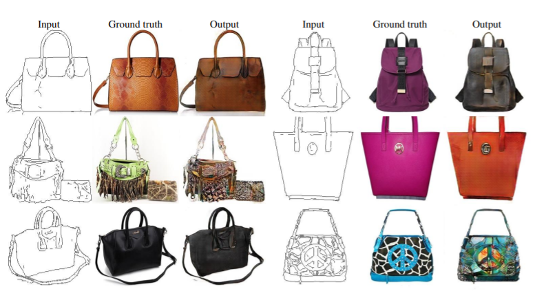
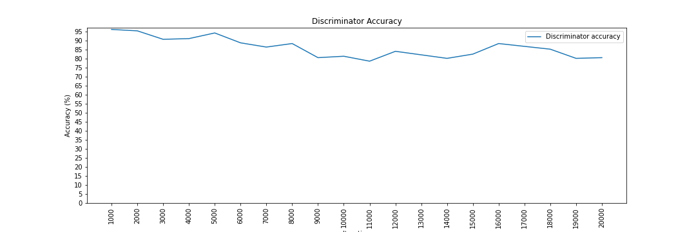
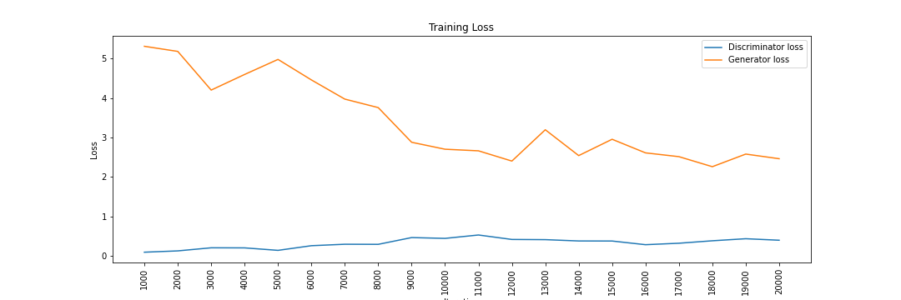

# [GAN(Generative Adversarial Networks)](https://arxiv.org/abs/1406.2661)
敵対的生成ネットワーク(Generative Adversarial Networks:GAN)は，ディープラーニングを用いた生成モデルの一つである．2つのネットワークを敵対的に競わせながら学習するアルゴリズムが特徴的である．実在しないデータを生成したり，存在するデータの特徴に沿って全く異なるデータを変換することができる．
構造の柔軟性やアイデア次第で多岐に渡って応用できる点から，今後発展が大いに期待されている．

---
主な活用事例としては，
- 自動着色アプリ
- 画像の自動生成
- 画像の超解像処理 など

---
今回は，手書き数字データセットとして知られるMNISTを用いて，画像の生成を試みる．実際に動かすと以下のような結果が得られる．
### 精度の推移

Discriminatorの精度が減少傾向にあることが分かる．これはGeneratorが生成する画像が学習するごとに，**より本物らしく**なっていることを示唆しており，Discriminatorを騙すようにGeneratorが学習していることが確認できる．

### 損失関数の推移

Discriminatorの損失関数は微量ながら増加傾向にあり，Generatorの損失関数は減少傾向にある．まだどちらのネットワークも収束していない．継続して学習することで，Generatorがより本物らしい画像を生成する可能性がある．

### 出力結果
---
参考文献\
[1] Generative Adversarial Networks, Ian J. Goodfellow, Jean Pouget-Abadie, Mehdi Mirza, Bing Xu, David Warde-Farley, Sherjil Ozair, Aaron Courville, Yoshua Bengio, 
https://arxiv.org/abs/1406.2661\
[2] Image-to-Image Translation with Conditional Adversarial Networks
Phillip Isola, Jun-Yan Zhu, Tinghui Zhou, Alexei A. Efros, CVPR2017, https://arxiv.org/abs/1611.07004\
[3] 