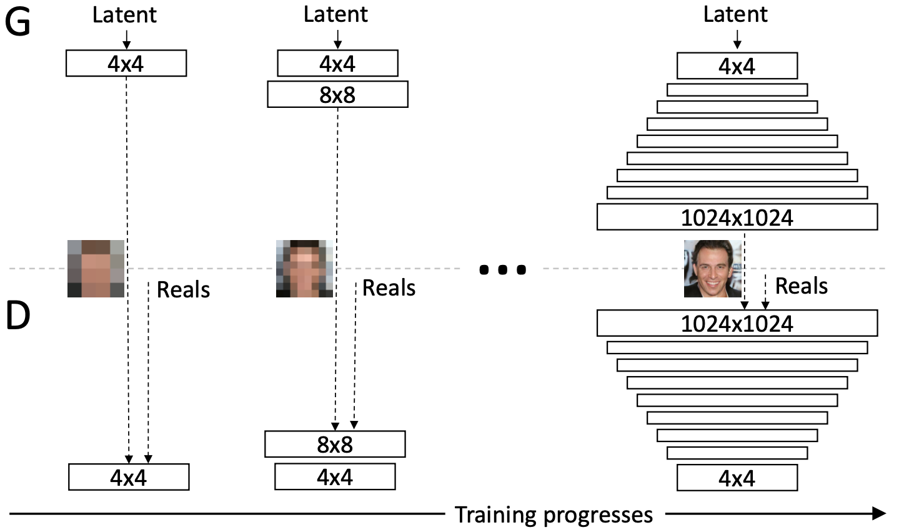
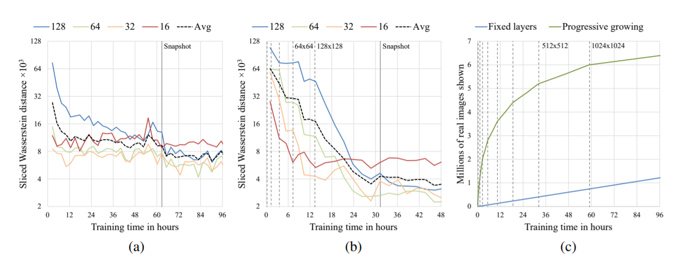

# [PGGAN(Progressive Growing of GANs)](https://arxiv.org/abs/1710.10196)
PGGAN(Progressive Growing of GANs)は，従来のGANモデルに比べ，1024x1024 pixelの高解像度の画像を生成できるモデルとして有名である．PGGANは学習プロセスとして，各層に対して段階的に学習させる手法をとっている．例えば，1層目(4x4)の学習が安定したら，2層目(8x8)を追加し学習する．2層目の学習も安定したら，3層目(16x16)を追加し学習…といった具合に．

画像生成タスクでは，画像の大局的特徴量と局所的特徴量をバランスよく捉えることが重要である．このネットワークでは低解像処理で画像の大局的特徴量を先に捉え，高解像度処理で局所的特徴量を捉えることができる．

さらに(c)に着目すると段階的に学習することで，学習時間に対し5.4倍の短縮に貢献していることが確認できる．

---
### 出力結果

---
### 参考文献
[1] "Progressive Growing of GANs for Improved Quality, Stability, and Variation," Tero Karras, Timo Aila, Samuli Laine, Jaakko Lehtinen, [arXiv:1710.10196](https://arxiv.org/abs/1710.10196), 2018.